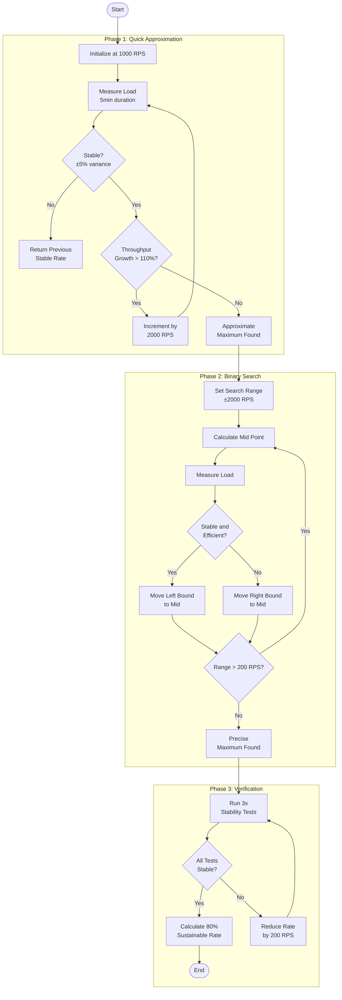

# ADR-02: Maximum load detection

## Context

Need a reliable method to determine maximum sustainable load for gRPC services that:

- Avoids false maximums from temporary throughput variations
- Efficiently searches through large load ranges
- Verifies stability of discovered maximum

## Decision

Implement a three-phase maximum load detection algorithm:

1. Quick Approximation Phase
   - Start at 1000 RPS
   - Use 2000 RPS increments
   - Stop when throughput growth falls below 110%

2. Binary Search Phase
   - Search window: ±2000 RPS around approximation
   - Use 200 RPS precision steps
   - Require 95% efficiency ratio (actual/target throughput)

3. Verification Phase
   - Require 3 stable measurements
   - Maximum 5% throughput variance allowed
   - Test duration: 5 minutes for initial, 2 minutes for stability

## Consequences

### Positive

- Reliable detection of true maximum capacity
- Efficient testing time through adaptive step sizes
- Built-in stability verification
- Clear sustainable load recommendation (80% of maximum)

### Negative

- Longer test duration due to multiple verification runs
- Resource overhead from repeated measurements
- May need parameter tuning for different service types

## Implementation Details

- Error rate tracking for each measurement
- P99 latency monitoring
- InfluxDB metrics storage
- Automated stability window calculations

--****-

